## Project: Implement Behaviorial Cloning in a Car Simulator

[](http://www.udacity.com/drive)

## Overview


**The purpose of this project is to clone human driving behavior by implementing a Deep Convolutional Neural Network**

## Project Outline

- Files Submitted
- Collect Driving Data and Image Processing
- Build a Deep Neural Network
- Train and Validate
- Test the Model

---

[//]: # "Image References"
[image1]: ./examples/placeholder.png "Model Visualization"

## Files Submitted

#### Submission includes all required files and can be used to run the simulator in autonomous mode

My project includes the following files:

- `ai-model-notebook.ipynb` the main notebook contains the code to create and train the model. All code referenced pertains to this notebook unless otherwise noted
- `drive.py` used for driving the car in autonomous mode
- `model.h5` containing a trained convolution neural network
- `video.mp4` footage of the car driving one lap autonomously
- `README.md` summarizing the results

#### To run the car autonomously

Using the Udacity provided simulator and my drive.py file, the car can be driven autonomously around the track by executing

```sh
python drive.py model.h5
```

#### Submission code is usable and readable

The model.py file contains the code for training and saving the convolution neural network. The file shows the pipeline I used for training and validating the model, and it contains comments to explain how the code works.

## Data Collection

The car records what it sees with a virtual camera at the front of the vehicle. This is the input of the model. The steering angle is also recorded and is linked to that camera image. The steering angle is the output or target for the model; the closer the model can predict the correct steering angle for a corresponding image the better the model performs, generally.

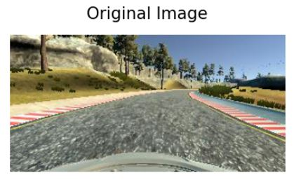

The charts below show the distribution of all the data collected. Note that no image processing/augmentation has taken place.

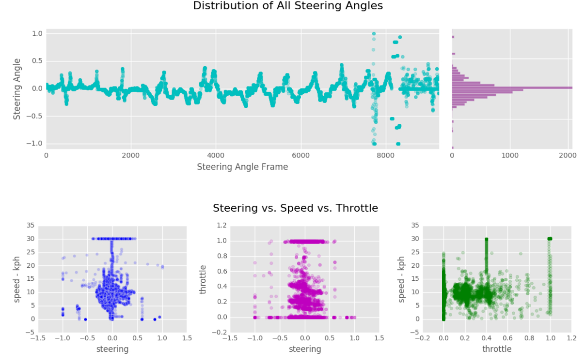

I recruited a friend to drive the car around the track as close to perfection as possible. One clockwise and one counterclockwise. He also included extreme turn corrections because the car needed to learn how to recover in case it deviates far from the center of the road.
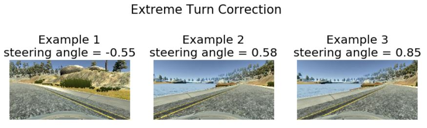

To avoid the car from being biased toward turning left or right, additional image/steering angle data was added by using OpenCV's flip method. The steering angle also had to be flipped as well

```python
cv2.flip(img, 1)
angle * -1.0
```

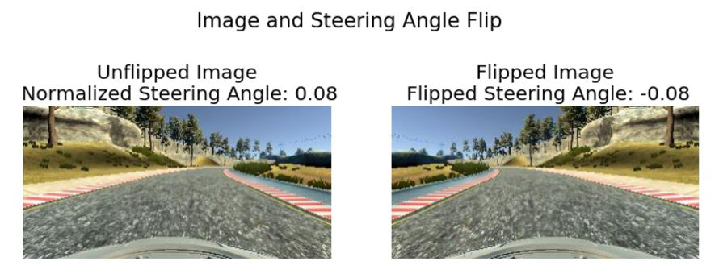

To further train the car to return to the center of the lane, I took advantage of the left and right cameras on the car. Essentially, I treated the car's left camera as its center-facing camera and changed the steering angle by an offset. That way, if the car center camera sees a picture similar to its left camera image, it will be trained to return to the lane's center.

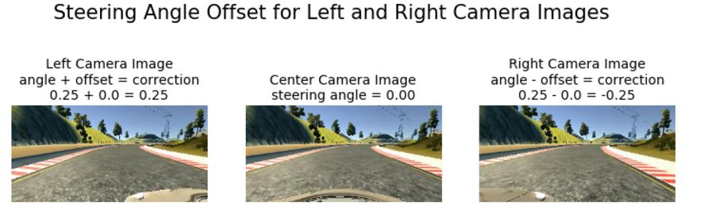

For each image that goes into training the model enters an image pipeline (located in the notebook's cell block `Create Generator Helper Functions`

Before image preprocessing, each image starts off as a Red, Green, and Blue channel image (160x320x3)


The image is then converted to a Hue Saturation Value (HSV) image and the Saturation channel is extracted. Exctracting just the S-channel helped the car detect the boundaries as it allows the edges of the road to standout while the road itself appears as a mostly flat color.

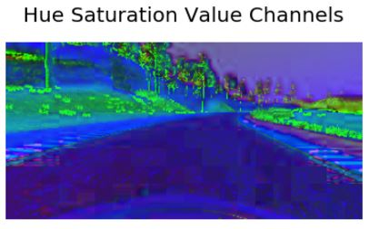

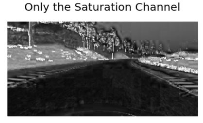

By now, the shape of the image is (160x320x1), where there is only one channel and not three (3 -> 1). The model simply does not need those original spatial dimensions (160x320) even though they help us humans see what the car sees. A image size of 64x64 works well for training as this retains enough data to train (not to mention the huge amount of training time saved!). In addition to resizing the image, the model doesn't need to be trained on the sky (top of the image) nor the hood of the car (bottom of the image) those parts are cropped.

```python
rows, cols = 64, 64
cv2.resize(img, (rows, cols), cv2.INTER_AREA)

# cropping is performed within a Keras layer Cropping2D as mentioned later
```

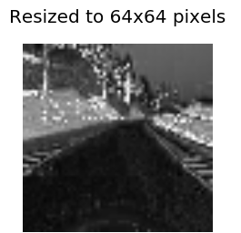
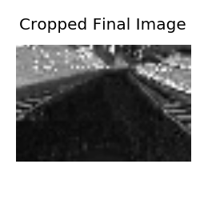

## Train and Validate Split

A train/validate data split of 20% was implemented. `line` is a list of all image data and steering angles.

```
python train_samples, validation_samples = train_test_split(lines, test_size=0.2)
```

## Python Generator

A python generator was created for a couple of reasons.

- We don't want to load thousands of images all at once into the computer's RAM. Instead, the images are loaded in small batches from a SSD (I found a SSD has about a 50% speed increase compared to a HD).
- We can image process these small batches of images on an as-needed basis
  The generator was created in the cell block `Create Generator` and the generator is implemented in the cell block `Train, Validate, and Save Model`. In addition, a generator for the validation images was used as well.

```python
 model.fit_generator(generator=train_generator ... validation_data=validation_generator)
```

During training, the model is trained on one small batch of images at a time. Here's the distribution of steering angles of five randomly chosen batches.
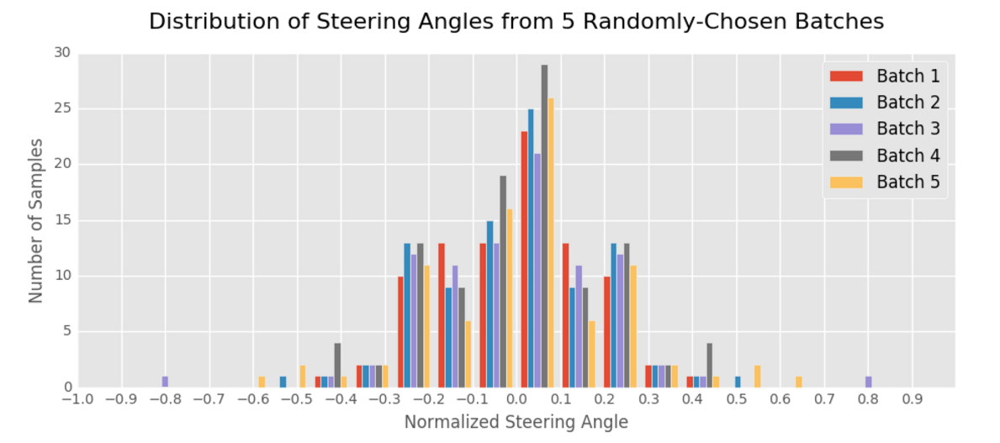
Unlike the original, unprocessed distribution of steering angles as shown earlier in **Data Collection**, the distribution of each batch resembles a normal Gaussian distribution. This is important as this enables the car to be robust in accepting multiple images with different corresponding steering angles. In other words, we want the car to drive straight in the middle of the road -- most of the time -- but we also want the car to know what to do during sharp turns, gradual turns, center-of-the-lane deviations, etc.

## Build a Deep Neural Network

My model is constructed in the cell block `Construct Model`.
The model follows the following structure:

| Layer            | Description                                                                                               |
| ---------------- | --------------------------------------------------------------------------------------------------------- |
| Input / Cropping | Accept a input image with a resized shape of (64,64,1). Also, crop the top 21% and bottom 8% of the image |
| Lambda           | Normalize the pixel values of each image from a range of 0-255 to +/- 0.5                                 |
| Convolution      | Convolve image into 32 feature maps using a 5x5 kernel size                                               |
| Activation       | RELU                                                                                                      |
| Max Pool         | Only select salient pixels with a kernel size of 2x2                                                      |
| Convolution      | Convolve previous layer into 64 feature maps using a 5x5 kernel size                                      |
| Activation       | RELU                                                                                                      |
| Max Pool         | Only select salient pixels with a kernel size of 2x2                                                      |
| Convolution      | Convolve previous layer into 128 feature maps using a 3x3 kernel size                                     |
| Activation       | RELU                                                                                                      |
| Max Pool         | Only select salient pixels with a kernel size of 2x2                                                      |
| Drop Out         | Kill off 20% of the previous neurons' activations                                                         |
| Flatten          | Take the previous layer's activation and flatten the values into an array                                 |
| Fully Connect    | Take input of the Flatten layer and link to 512 neurons                                                   |
| Activation       | RELU                                                                                                      |
| Drop Out         | Kill off 10% of the previous neurons' activations                                                         |
| Fully Connect    | Take input of the Flatten layer and link to 100 neurons                                                   |
| Activation       | RELU                                                                                                      |
| Fully Connect    | Take input of the previous layer and link to 10 neurons                                                   |
| Activation       | RELU                                                                                                      |
| Fully Connect    | Take input of the previous layer and link to 1 neuron                                                     |

## Input

The input of the model is a resized image from the generator. Resizing the image improves training time without giving up detail. A few students' blogs recommended a spatial size of 64x64 pixels [here](http://ottonello.gitlab.io/selfdriving/nanodegree/2017/02/09/behavioral_cloning.html) and [here](https://chatbotslife.com/using-augmentation-to-mimic-human-driving-496b569760a9)

```python
model.add(Cropping2D(cropping=((14,5),(0,0)), input_shape=(64, 64, 1)))
```

The model also crops away the top and bottom of the image -the sky and the car's hood- as these are parts of the image are unrelated to the steering angle.
Input normalization is important for all neural networks to allow for a successful and efficient gradient descent. A Lambda layer normalizes all pixel values from a range of 0-255 to +/- 0.5

```python
model.add(Lambda(lambda x: x / 255.0 - 0.5))
```

## Activation

The model includes Rectified Linear Unit (ReLU) Activation layers to introduce nonlinearity. This type of activation ignores negative inputs and is shown to be computationally efficient for deep neural networks.

## Convolution / MaxPool

I implemented a similar architecture to NVidia's [end-to-end model](http://images.nvidia.com/content/tegra/automotive/images/2016/solutions/pdf/end-to-end-dl-using-px.pdf). Similar to other student's architecture, [here]() and [here]() as well as NVidia's, a common tactic is to extract more and more feature layers with each subsequent convolutional layer. The reasoning is that each convolution layer extracts higher and higher levels of abstractions from the previous convolution layer.
This is why I chose the depth of each of my convolution layers to be 32, 64, and 128. Below is a peek of the model's feature maps for each convolution layer for a single test image. The first convolution layer contains 32 feature maps. Areas with more white resemble high-activations areas - parts of the neural network that become 'excited' and propagate deeper into the network.

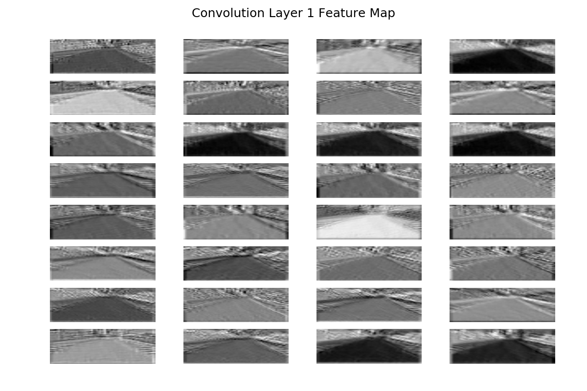

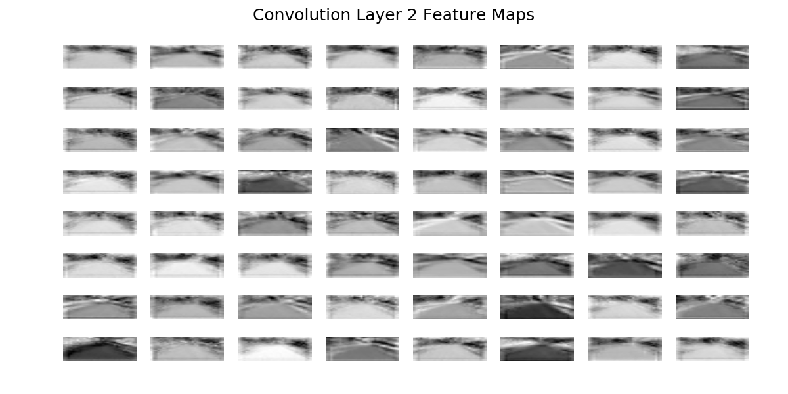

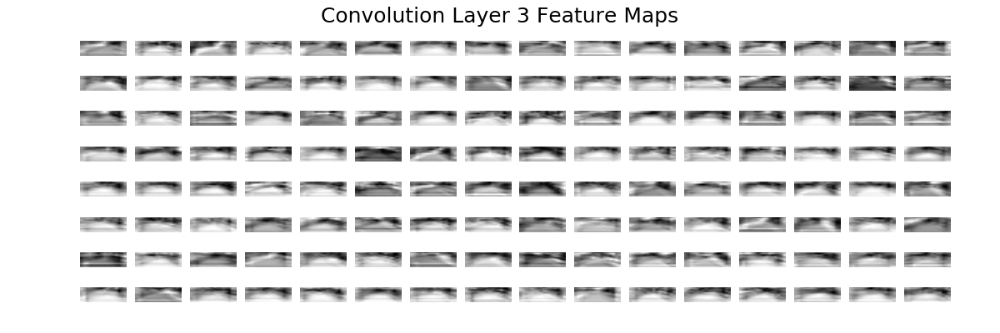

## Fully Connected Layers

After testing various implementations of the number of fully connected layers and the number of connections each one hold, I ended up using four fully connected layers. The model concludes with a single output neuron that denotes a normalized steering angle value. I found that the number of neurons made no significant impact on the performance of the car, although increasing the number of neurons also increased training time. Ultimately, the goal is to decrease the number of neurons in each subsequent layer until the desired number is reached: 512 -> 100 -> 50 -> 10 -> 1

## Drop Out Layers

I added two drop out layers that only drop a small percentage of the previous layers' activations. For example,

```python
model.add(Dropout(0.2))
```

Before adding the dropout layers, I noticed the car would become 'stickier' to certain parts of the course -- as if it memorized exactly where it wanted to go even if that meant making stark and questionable turns. If my dropout was too much , the car's driving appeared to be more 'slippery' in that it seemed to refuse to stick to a particular path and would drift, especially on the curves. I ended up only dropping 20% of the third convolution layer's activation and only 10% of the first fully connected layer's activations.

## Model Optimizer and Loss Calculator

I chose a ADAM optimizer (code cell `Train, Validate, and Save Model`). A learning rate does not need to be implemented as this is built into the optimizer. ADAM is a type of SGD that takes advantage of its previous computed gradients in order to apply wiser, subsequent gradient calculations.

```python
model.compile(loss='mse', optimizer='adam')
```

For the model's loss calculation, the driving challenge is similar to solving a classic regression problem:

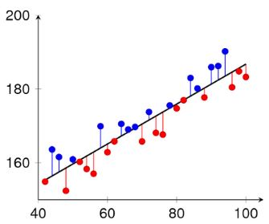

[\*image source](http://pgfplots.net/tikz/examples/regression-residuals/)

The model's loss is calculated using Mean Squared Error (MSE) loss. This was chosen as the model tries to _fit_ not _classify_ a target steering angle to its input image.

## Train and Validate

## Training Strategy

I implemented a piece of advice from my previous project review in that the model's training is conditional on its calculated loss improvement; it stops training when the error loss stops decreasing. I averaged the last three validation loss and compared that value with the current validation loss -- if the model's current validation loss is less than the average loss continue training. In addition, the model is saved after each epoch, that is, only if the validation loss improves. This strategy is implemented cell block `Train, Validate, and Save Model`

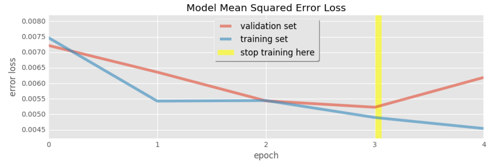

I found the absolute value of the training or validation MSE loss was not an explicit indicator that the car would drive successfully.

After the car successfully drove around most of the track, I noticed trouble spots on the course: sharp turns. Although tuning parts of the model helped (Dropout, MaxPool, more/less fully connected layers, etc) I realized more training was needed just in those sharp turns. I drove/trained the car on how to approach the turns with six iterations for each turn. I also emphasized hugging the inner curve. As human drivers, it's much more natural to turn closer to the inner curve and override the sensation of centripetal force than to let the car drift to the outer curve.

## Test the Model

Ultimately, a successful model means that the car is able to drive one lap around a test track.

**The car shall:**

- not have its tires leave the any part of the track
- not climb or hit any of the road's raised ledges
- not hit any of the coure's landmarks/structures (posts, bridge railing, etc.)

The final video of the car driving autonomously is uploaded as `video.mp4`
